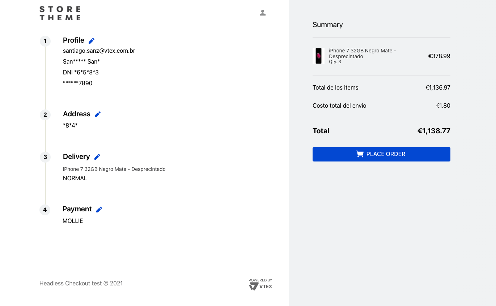

# CUSTOM CHECKOUT IO

## 🚨 Warning - Read first

TO CONTINUE, YOU SHOULD BE FAMILIAR WITH THE [CHECKOUT API](https://developers.vtex.com/vtex-rest-api/reference/checkout-api-overview)

This project showcases how to make use of our `IO infrastructure` and our `store-framework` to develop your custom Checkout geared 100% towards our API; as such this app behaves as a **template**, a jumpstart to be built upon.

The mayority of the `complexity` and `business rules` (XSTATE Machine, Multi-repo oriented, Orderform V2, Country settings/rules) that are found in the original approach are scrapped.

---



## Limitations / Known issues

- `No PICKUP POINTS selector`
- Because of no country settings/rules all inputs lack `validations`
- Service routes respond with full orderform, a good enhancement would be to add `expected sections` or migrate to `graphql`
- No `coupons` input
- No `additional information for deliveries` input
- No `auth-app` for payments (Payments legacy extensions)

## Migration

By using this you'll be migrating your whole Checkout flow to Store-framework; this means that your CART and CHECKOUT will be both inside your `store`. If you have any custom implementation done via JS apps/scripts, you'll need to redo them to work with this app.

## Architecture

You can see the whole architecture of the `CHECKOUT` phase in this [DIAGRAM](./docs/diagram.png) the `CART` phase is [still the original approach](https://github.com/vtex-apps/checkout-cart)

## Implementation

A custom version of [vtex.checkout](https://github.com/vtex-apps/checkout) is required to enable both routes (cart and checkout) in your store. Please contact the European CX team for more information.

You'll find new routes inside your store that point to specific interfaces, such as `store.checkout.order-form`; any block declared inside it will be rendered in the `/checkout` store page.

This app declares `custom templates` leveraging the power of the store-framework.  
In our example, we use our `custom-container`, and within it the layout:

**You'll need to access your admin -> pages and select your template for each page if you want to use other theme**

```json
"store.checkout.order-form": {
    "blocks": [
      "checkout-container"
    ]
  },
  "checkout-container": {
    "children": [
      "responsive-layout.desktop#checkout",
      "responsive-layout.mobile#checkout"
    ]
  },
```

With all of this in mind, now your Checkout structure would look like this:

```
checkout (controlled bu vtex.checkout@x.x)
└── checkout-cart (controlled by vtex.checkout-cart@0.x)
|   ├── product-list
|   ├── checkout-summary
|   |   └── checkout-coupon
|   └── shipping-calculator
|       └── checkout-shipping
|
└── checkout-container (controlled by this app)
    ├── identification
    ├── custom-summary
    ├── place-order
    └── step-group
        ├── profile-step
        ├── address-step
        ├── delivery-step
        └── payment-step

```

## Blocks included

- Identification phase (smart-checkout enabler)
- Items and totals summary
- Custom Place-order button
- And 4 basic steps:

1. A `Profile` step
2. An `Address` step
3. A `Delivery` step
4. A `Payment` step

## Steps

Think of the `STEPS` as an abstraction for any type of data you want to control.  
For example the minimum data required to complete an order would be the `client profile`, the `client address`, the `delivery SLA` and the `type of payment`. And that's why we ship 4 basic steps that handle those.

Also you'll notice that each step provides a `Summary` for UX purposes; this is due to how we manage the routing. You could create your own `step-group` without it!

## About the Custom Service

`USING THIS SERVICE IS NOT MANDATORY`

The [CHECKOUT IO CLIENT](https://github.com/vtex/io-clients/blob/master/src/clients/checkout.ts) is reused to provide a custom layer via our service routes.  
The implemented middlewares don't modify the data, they are only handling errors in a friendly manner and leaving a space for any integration.

If you go to the [service.json](./node/service.json) file, you'll find all the routes our service expose. And [here](./node/index.ts) how they are resolved.  

All the PATHS are just like any endpoint to fetch to.

So for i.e, if you want to hit the `updateOrderFormPayment` [middleware](./node/middlewares/updateOrderFormPayment.ts) you can do it by fetching  
 `/checkout-io/update-payment`.  
 Analog to the [CHECKOUT ATTACHMENT API ENDPOINT](https://developers.vtex.com/vtex-rest-api/reference/cart-attachments#addpaymentdata).

So you will need the same data. The `orderFormId` and the `payments` object.  
You'll see that we request those in the middleware:

```ts
const { orderFormId, payments } = await json(ctx.req)
```

With this, you could create your own routes and middlewares to any API, `internal or external` and manage what the server does for you. The intention is to use it to compute data you don't want the frontend to do.

For example, instead of the API returning the orderform to the frontend, you could do validations on the server, and just return 'OK' when updating the orderform. This would make your Checkout blazing fast!

### Graphql

We also created a single Graphql query to provide the OrderForm. Understand that [the orderform returned](./graphql/types/OrderForm.graphql) is altered to suit the minimum needs; you can remove/add the information you want to have at hand inside the Checkout!

We did this as the OrderForm is a central part of the Checkout flow. So it made sense to have it resolved in a performant way.

## What can you do with all of this?

- Declare your own Checkout Store Theme
- You can add your own steps without interrumpting the flow (Via store framework)
- You can copy, modify and reuse the current steps
- Add your own validations before fulfilling an Order (Custom business rules)
- Integrate your own services (for i.e resolve your own SLAs for Delivery)

## Development Utilities

### Order context + useOrder hook

Provides the `ORDERFORM`!

This is `CRITICAL` and `CENTRAL` to the operation of the Checkout.  
We feed this context via our own custom GRAPHQL service communicating directly to the API.

```ts
interface Context {
  orderForm: OrderForm
  orderError: ApolloError | undefined
  orderLoading: boolean
  refreshOrder: (variables?: any) => Promise<any>
}
```

And the hook connects with the context

```ts
const { orderForm, orderError, orderLoading, refreshOrder } = useOrder()
```

### Checkout context + useCheckout hook

This is a custom context for shared data, useful to communicate things between other components outside the steps.

For example, we use it to know if there're no deliveries available for ALL ITEMS:

```ts
const getCheckoutDeliveries = () => {
  const exhaustedDeliveries =
    orderForm?.shippingData?.logisticsInfo.every(
      (item: LogisticsInfo) => item.slas.length === 0
    ) ?? false

  return { exhaustedDeliveries }
}
```

### useForm hook

You can use this hook to read FORM's values or reset them

```ts
const [clientPreferences, handlePreferencesChange, reset] = useForm(
  clientPreferencesData
)
```

### useFetch hook

A hook wrapping the `fetch()` API. You can use it to communicate with the VTEX API or your own, and receive status updates!

```ts
const [response, isFetching, setRequest] = useFetch({} as IRequestInfo);

const apiRequest = Build you request based on "IRequestInfo" type.

setRequest(apiRequest);
```

### Router

The way we change steps is via React Router, you can see the following example:

```ts
history.push(routes.INDEX)
```

When the url route changes the switch will show a component or the other.

```ts
const DeliveryStep: React.FC = () => {
  return (
    <Step>
      <Switch>
        <Route path={routes.SHIPPING}>
          <DeliveryForm />
        </Route>
        <Route path="*">
          <DeliverySummary />
        </Route>
      </Switch>
    </Step>
  )
}
```

---

## Possible Enhancements

Creating a Checkout from scratch requires a lot of work and planning. Here're some possible additions to this project:

- Make the custom Service return a validation check instead of whole orderform body
- Add a system to track which step is active, this could help create a better UX
- A REGEX for postal codes with a country selector would be nice
- Add the date and price of SLAs to the delivery summary
- Postal code address resolver using Google geolocation services
- Debug toolbar (Manual Orderform refresher / Cartman / etc )
- A SLOT store-framework interface to put custom messages below each item in the summary (Info purposes like "no SLA available")
